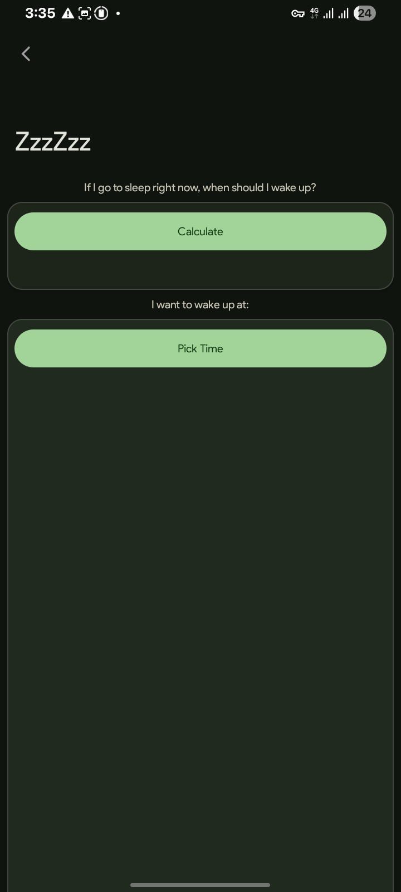

# ZzzZzz-Sleep-Better
A simple, open-source app to calculate your sleep and wake times👍, don't oversleep again. 🪄

# ZzzZzz - Refreshed Wake Up 🌙

**Sleep smarter, not longer.** A simple, lightweight, and stylish Android application to calculate your optimal sleep cycles. Built with love (and caffeine).

 

## 📸 Screenshots

## ✨ Features

* **🚀 Sleep Now Calculation:** Tells you exactly when to wake up if you go to bed right this second.
* **⏰ Wake Up Time Picker:** You pick the time you want to wake up, and it tells you when to sleep.
* **🎨 Material You Design:** sleek Dark Mode with Green accents (because we care about your eyes at night).
* **⚡ Lightweight:** Runs smoothly even on older devices (Optimized for efficiency).

## ⚠️ A Note About the Source Code, Project
> **"It works on my machine, Sketchware!"** 🗿
> **" I Dont Tested Android Studio Version, But This app Fully Created In Sketchware PRO.🪄 Used Sketchware Feature To Export Android Studio Source. And i dont know its working in Android Studio Or Not 😭"**

Look, I'm gonna be honest with you. The app works perfectly, the UI is fire, but the source code under the hood is... let's call it **"Creative Chaos"**. Android Studio And Swb File is too Messy and incomprehensible .
I used some *unique* string arrangements and *abstract* coding styles. If you look at the code and get a headache, that's a feature, not a bug. 😂

**Pull Requests?** Sure, if you are brave enough to untangle the spaghetti! 🍝

## 🛠️ Tech Stack
* **Language:** Java / Android SDK
* **Design:** Material Design 3 Components

## 📥 Download
Go to the **[Releases]** page to download the latest APK and start sleeping better tonight!

---
Made with 🖤 by **Shiba**

